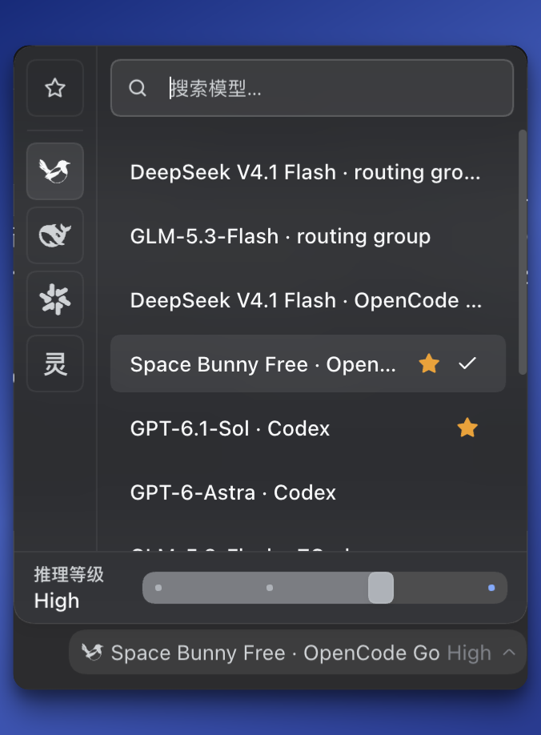

# DSH 模型控制器（DSH Model Controls）

官方 DeepSeek Harness 的模型控制插件：切换模型、调节思考强度、收藏模型与调整供应商顺序。源码、构建工具和产物均在本目录；构建不需要 DSH003。运行时使用宿主提供的 React、插槽、模型目录和 MenuSurface。界面名称为 DSH 模型控制器。

包名为 `@kewen/dsh-model-controls`（此前版本叫 `@dsh-std/model-picker`，改名不影响已有收藏、思考强度与供应商排序——它们按浏览器本地存储，不按包名）。插件按 [dsh-std](https://github.com/Yan-Zero/dsh-std) 社区协议声明 `apiVersion: dsh-std/v1`，协议坐标与 npm 包名相互独立。



面板一次做完四件事：搜索模型、按供应商切换、收藏常用模型（左侧星标），以及**为当前模型单独调思考强度**——底部的推理等级滑杆按模型各自记住档位，换模型再回来还是上次那个值。

## 安装

1. 到 [Releases](https://github.com/Hu9956/DSH-model-controls/releases) 下载最新的 `kewen-dsh-model-controls-<版本>.tgz`。
2. 在 DSH 插件页的安装入口填写该文件的绝对路径，例如 `/Users/你的用户名/Downloads/kewen-dsh-model-controls-0.2.0.tgz`。
3. 按宿主提示重载。插件应列在 **已安装** 中，名称为 **DSH 模型控制器**；详情页提供配置、启用/禁用和卸载入口。

安装包声明 `dsh.bundle.patch`，由官方管理器安装依赖、加入 profile bundle 并加载插件，不需要手工添加插入项。插件通过优先级接管官方 model 插槽，禁用后由官方选择器接回。避免同时保留旧的绝对路径插入项，以免重复加载。

自己构建安装包：

```sh
npm ci --ignore-scripts
npm run verify
npm pack
```

### 路由器显示身份（可选）

**标准 Magpie 接入无需填写任何设置。**插件读取唯一活动的 DeepSeek API-key 供应商已接受的运行配置：凭据引用为 `MAGPIE_API_KEY`，且请求地址为回环主机（127.0.0.1、localhost 或 ::1）的 `/v1` 接口时，自动显示 Magpie。依据已核对的 Magpie `internal/agent/dsh.go` 接入实现；不读取密钥内容，不根据模型名称猜测，不固定端口。撤掉路由后刷新界面恢复原供应商。

在 **已安装 → DSH 模型控制器** 中提供 **备用 Magpie 接口地址**，仅用于自定义接入未被识别的情况；留空使用自动识别。表单复用 DSH 官方 `SettingsForm`、`SettingsValueField` 和 `SettingsFormModel`，通过官方配置服务持久保存，不修改请求路由。

这项设置只识别已经配置好的路由，不会安装、启动 Magpie，也不会替你修改 Harness 请求地址。仅安装了 Magpie 而请求地址未改动时，不会显示 Magpie。若把 Harness 的 `deepseek-official` 请求地址改到 Magpie，模型目录的真实提供方 ID 仍是 `deepseek-official`，只有展示名称与图标改变。

显示身份只改变模型入口、提供方栏及收藏夹的名称/图标（`magpie` 使用 [yetone/magpie](https://github.com/yetone/magpie) 的原始 SVG，收紧留白并继承界面文字颜色；原项目为 MIT 许可）；实际请求提供方、模型 ID、收藏与思考强度存储键均不变。切换路由后需刷新界面才会重新判断。不要仅凭模型名称、密钥名称或“本地地址”猜测路由来源。

## 更新与回退

更新前保留旧安装包。下载或构建新版安装包后，通过插件管理器安装，再按宿主提示重载。安装后运行的是 profile 中的包副本，修改源码目录不会自动更新已安装版本；回退时安装保留的旧包。

## 卸载

在插件管理器的详情页卸载，再按宿主提示重载。包提供的插入项会随 bundle 移除，官方模型选择器接回。卸载不自动删除收藏、供应商排序和思考强度偏好；重装后这些偏好仍在。

## 更新记录

开发过程见 [CHANGELOG.md](CHANGELOG.md)。

## 许可

MIT，见 [LICENSE](LICENSE)。包内含 [yetone/magpie](https://github.com/yetone/magpie) 的图标（MIT），署名见 [MAGPIE_ASSET_LICENSE.md](MAGPIE_ASSET_LICENSE.md)。

## 兼容与保存位置

构建依赖使用公开发布的 DSH `0.1.7-rc.2` 类型包及 Cordis `4.0.4`。宿主需要提供 `modelDirectories.directoryFor`、会话服务、`conversation.input.model` 插槽、MenuSurface 和模块加载器。此条件不代表任意旧版本或未来版本都兼容；宿主升级后应重新验证。

客户端偏好使用 localStorage：

- `dsh003.model-picker.model-efforts`
- `dsh003.model-picker.favorites`
- `dsh003.model-picker.provider-order`

改插件文件路径不会主动清空这些数据；数据属于当前客户端 origin，不会跨应用或设备同步。会话当前模型由宿主保存，插件保存每个模型接受成功的档位偏好。
